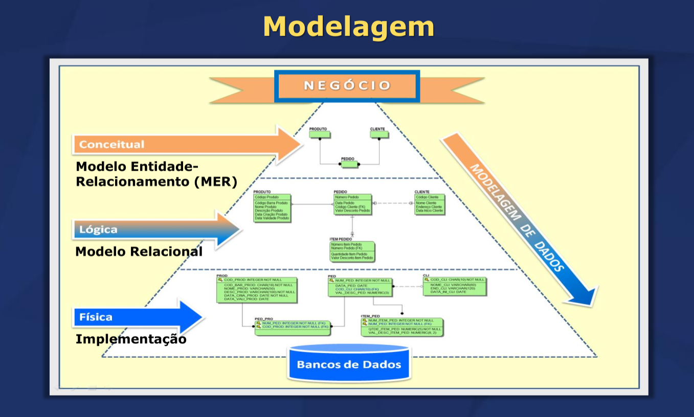
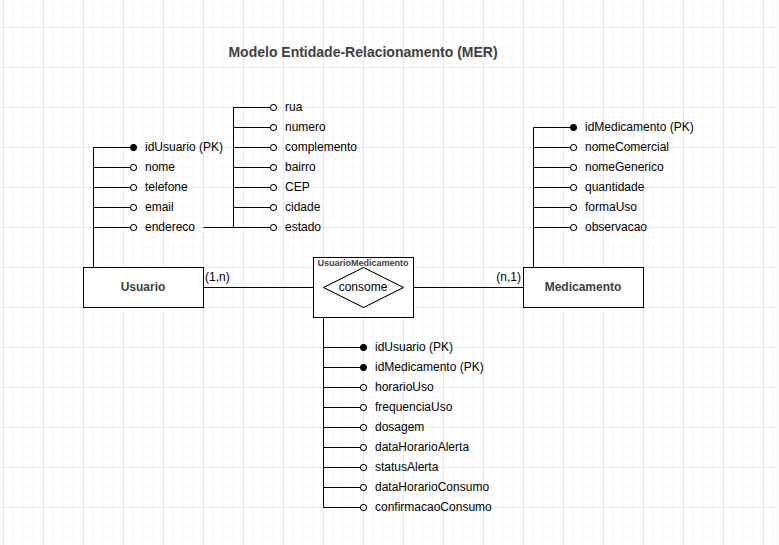
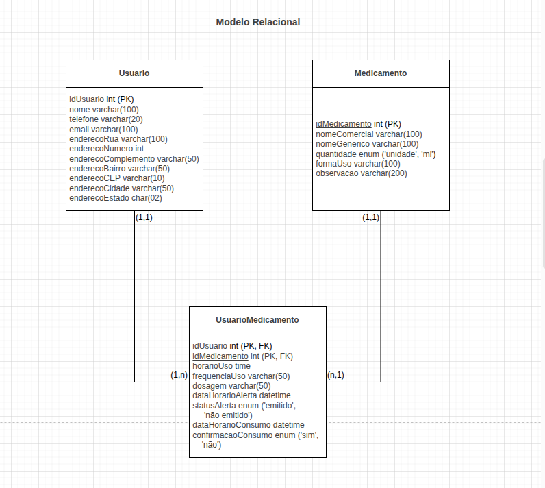

# 📅 Dia 2 — 14/04/2026 | Banco de Dados com MySQL

> Segunda aula do **Bootcamp I 2026** — Escola Politécnica/UNINTER
> Profª. Drª. Neusa Grando

---

## 🎯 Agenda

- Engenharia de Requisitos — Requisitos funcionais e não funcionais
- Banco de Dados Relacional:
  - Modelo conceitual (MER)
  - Modelo lógico (Relacional)
  - Modelo físico (Implementação SQL)

---

## 📐 Modelagem de Dados

A modelagem passa por três níveis, do mais abstrato ao mais concreto:

```
NEGÓCIO
   ↓
Conceitual → Modelo Entidade-Relacionamento (MER)
   ↓
Lógico    → Modelo Relacional
   ↓
Físico    → Implementação (SQL)
   ↓
Banco de Dados
```
<br>

---

## 📌 Levantamento de Requisitos

### Requisitos Funcionais — *O que o sistema faz*

Estão ligados diretamente às ações, serviços e operações que o sistema oferece ao usuário.

| # | Requisito |
|---|-----------|
| RF01 | O sistema deve cadastrar usuários |
| RF02 | O sistema deve permitir cadastrar medicamentos |
| RF03 | O sistema deve emitir alertas nos horários programados |
| RF04 | O usuário deve confirmar que tomou o medicamento |
| RF05 | O sistema deve armazenar o histórico de uso |

### Requisitos Não Funcionais — *Como o sistema opera*

Estão ligados a desempenho, segurança, usabilidade e confiabilidade.

| # | Requisito |
|---|-----------|
| RNF01 | O sistema deve ser fácil de usar |
| RNF02 | O sistema deve ter tempo de resposta inferior a 2 segundos |
| RNF03 | O sistema deve garantir segurança dos dados do usuário |
| RNF04 | O aplicativo deve funcionar em dispositivos móveis Android |
| RNF05 | O sistema deve estar disponível 24 horas por dia |

---

## 📋 Regras de Negócio

- **Usuário:** armazenar identificador, nome, telefone, e-mail e endereço (rua, número, complemento, bairro, CEP, cidade e estado)
- **Medicamento:** armazenar identificador, nome comercial, nome genérico, quantidade (unidade ou ml), forma de uso e observações adicionais
- **Uso:** armazenar horário de uso, frequência, dosagem, data/horário de alerta, status do alerta (emitido ou não emitido), data/horário de consumo e confirmação de consumo (sim ou não)
- **Cardinalidade:** um ou vários usuários pode consumir um ou vários medicamentos **(N:M)**

---

## 🔷 Modelo Entidade-Relacionamento (MER)

O MER contempla: entidades, atributos, relacionamentos, cardinalidades, chaves primárias e chaves estrangeiras.

### Entidades e atributos

**Usuario**
- `idUsuario` (PK) — identificador único
- `nome`, `telefone`, `email`
- `endereco` — atributo composto: rua, número, complemento, bairro, CEP, cidade, estado

**Medicamento**
- `idMedicamento` (PK) — identificador único
- `nomeComercial`, `nomeGenerico`
- `quantidade` (unidade ou ml), `formaUso`, `observacao`

**UsuarioMedicamento** *(tabela de relacionamento N:M)*
- `idUsuario` (PK, FK), `idMedicamento` (PK, FK)
- `horarioUso`, `frequenciaUso`, `dosagem`
- `dataHorarioAlerta`, `statusAlerta` (emitido / não emitido)
- `dataHorarioConsumo`, `confirmacaoConsumo` (sim / não)

### Cardinalidades

```
Usuario (1,n) ◇ consome ◇ (n,1) Medicamento
```

Um usuário pode consumir vários medicamentos, e um medicamento pode ser consumido por vários usuários.

<br>

---

## 🔶 Modelo Relacional

Define o tipo de dado de cada campo com base no MER.

**Usuario**
```
idUsuario            INT           PK AUTO_INCREMENT NOT NULL
nome                 VARCHAR(100)  NOT NULL
telefone             VARCHAR(20)   NOT NULL
email                VARCHAR(100)  NOT NULL
enderecoRua          VARCHAR(100)
enderecoNumero       INT
enderecoComplemento  VARCHAR(50)
enderecoBairro       VARCHAR(50)
enderecoCEP          VARCHAR(10)
enderecoCidade       VARCHAR(50)
enderecoEstado       CHAR(02)
```

**Medicamento**
```
idMedicamento   INT           PK AUTO_INCREMENT NOT NULL
nomeComercial   VARCHAR(100)  NOT NULL
nomeGenerico    VARCHAR(100)
quantidade      ENUM('unidade', 'ml')
formaUso        VARCHAR(100)
observacao      VARCHAR(200)
```

**UsuarioMedicamento**
```
idUsuario           INT       PK FK → Usuario
idMedicamento       INT       PK FK → Medicamento
horarioUso          TIME      NOT NULL
frequenciaUso       VARCHAR(50)
dosagem             VARCHAR(50)   NOT NULL
dataHorarioAlerta   DATETIME  NOT NULL
statusAlerta        ENUM('emitido', 'não emitido') NOT NULL
dataHorarioConsumo  DATETIME
confirmacaoConsumo  ENUM('sim', 'não') NOT NULL
```

<br>
---

## 🔧 Modelo Físico — Implementação SQL

### Criação do banco e tabelas

```sql
create database MedAlerta;
use MedAlerta;

create table Usuario (
    idUsuario           int auto_increment not null,
    nome                varchar(100) not null,
    telefone            varchar(20) not null,
    email               varchar(100) not null,
    enderecoRua         varchar(100),
    enderecoNumero      int,
    enderecoComplemento varchar(50),
    enderecoBairro      varchar(50),
    enderecoCEP         varchar(10),
    enderecoCidade      varchar(50),
    enderecoEstado      char(02),
    primary key (idUsuario)
);

create table Medicamento (
    idMedicamento  int auto_increment not null,
    nomeComercial  varchar(100) not null,
    nomeGenerico   varchar(100),
    quantidade     enum('unidade', 'ml'),
    formaUso       varchar(100),
    observacao     varchar(200),
    primary key (idMedicamento)
);

create table UsuarioMedicamento (
    idUsuario           int not null,
    idMedicamento       int not null,
    horarioUso          time not null,
    frequenciaUso       varchar(50),
    dosagem             varchar(50) not null,
    dataHorarioAlerta   datetime not null,
    statusAlerta        enum('emitido', 'não emitido') not null,
    dataHorarioConsumo  datetime,
    confirmacaoConsumo  enum('sim', 'não') not null,
    primary key (idUsuario, idMedicamento),
    foreign key (idUsuario) references Usuario (idUsuario),
    foreign key (idMedicamento) references Medicamento (idMedicamento)
);
```

---

### Inserção de dados

```sql
-- 10 usuários de exemplo
insert into Usuario (nome, telefone, email, ...) values
    ('Ana Souza', '41999990001', 'ana.souza@email.com', ...),
    ('Bruno Lima', '41999990002', 'bruno.lima@email.com', ...),
    ...;

-- 10 medicamentos de exemplo
insert into Medicamento (nomeComercial, nomeGenerico, ...) values
    ('Tylenol', 'Paracetamol', ...),
    ('Advil', 'Ibuprofeno', ...),
    ...;

-- 15 registros de uso
insert into UsuarioMedicamento (idUsuario, idMedicamento, ...) values
    (1, 1, '08:00:00', '8 em 8 horas', '1 comprimido', ...),
    ...;
```

> ⚠️ A ordem de inserção deve respeitar as dependências: `Usuario` e `Medicamento` antes de `UsuarioMedicamento`.

---

## ✅ Conferência de Integridade Referencial

A ordem de criação e inserção deve respeitar as dependências:

```
Usuários → Medicamentos → UsuarioMedicamento
```

- Usuários devem existir antes dos medicamentos serem associados
- Medicamentos devem existir antes de serem associados a usuários
- Um alerta possui no máximo um registro de uso


---

*Bootcamp I — 2026 | Escola Politécnica/UNINTER*