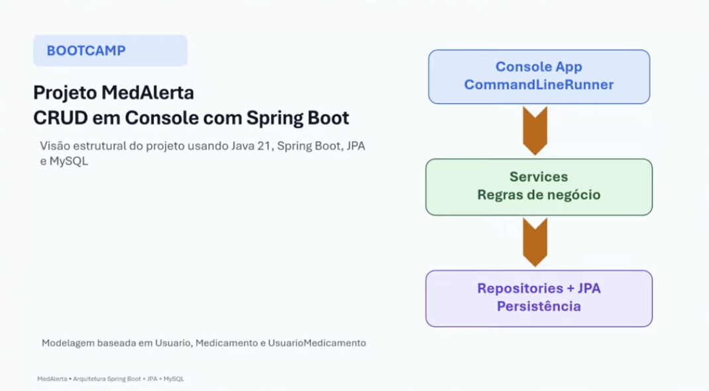
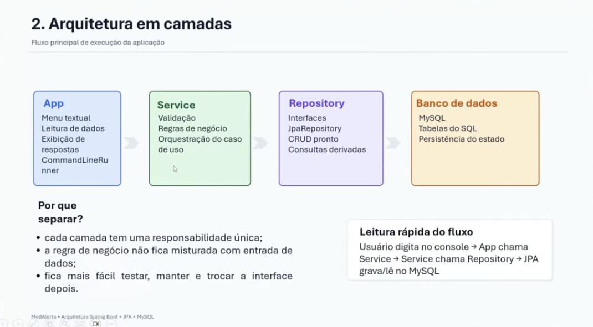
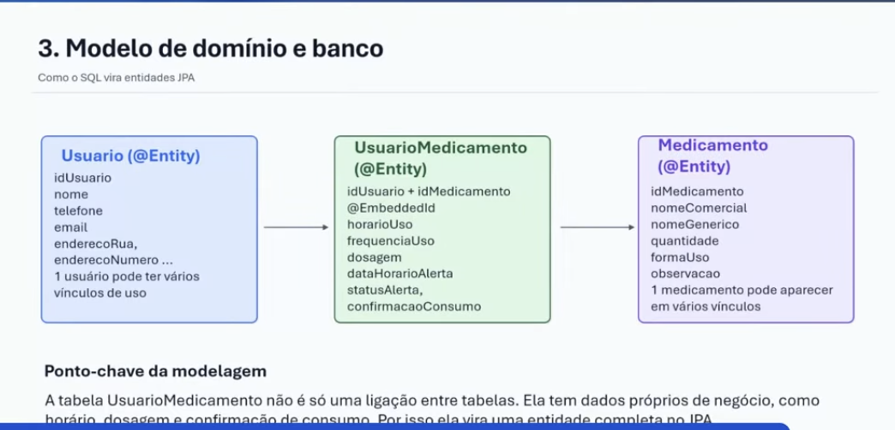
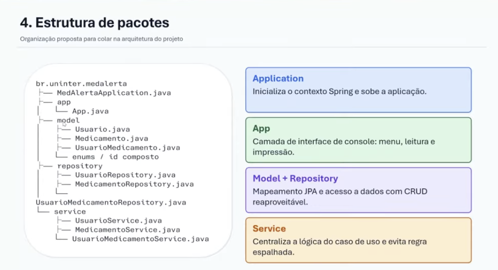
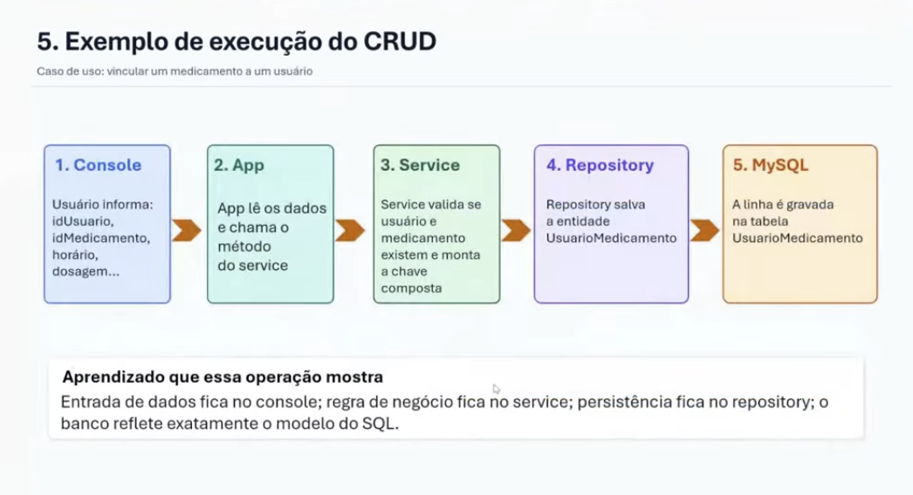

# 📅 Dia 3 — 15/04/2026 | Programação + CRUD

> Terceira aula do **Bootcamp I 2026** — Escola Politécnica/UNINTER
> Prof. Me. Rodrigo Nascimento

---

## 🎯 Visão geral

**Projeto MedAlerta — CRUD em Console com Spring Boot**

Visão estrutural do projeto usando:
- Java 21
- Spring Boot
- JPA
- MySQL

Modelagem baseada em `Usuario`, `Medicamento` e `UsuarioMedicamento`.

<br>


---

## 🏗️ 1. Arquitetura em camadas

Fluxo principal de execução da aplicação:

```
Console App (CommandLineRunner)
        ↓
   Services (Regras de negócio)
        ↓
  Repositories + JPA (Persistência)
```

### As 4 camadas

| Camada | Responsabilidade | Componentes |
|---|---|---|
| **App** | Interface com o usuário | Menu textual, leitura de dados, exibição de respostas, CommandLineRunner |
| **Service** | Regras de negócio | Validação, regras de negócio, orquestração do caso de uso |
| **Repository** | Acesso aos dados | Interfaces, JpaRepository, CRUD pronto, consultas derivadas |
| **Banco de dados** | Persistência | MySQL, tabelas do SQL, persistência do estado |


<br>


### Por que separar as camadas?

- Cada camada tem uma **responsabilidade única**
- A regra de negócio não fica misturada com entrada de dados
- Fica mais fácil testar, manter e trocar a interface depois

### Leitura rápida do fluxo

```
Usuário digita no console
        ↓
      App chama Service
        ↓
    Service chama Repository
        ↓
    JPA grava/lê no MySQL
```


---

## 🗃️ 2. Modelo de domínio e banco

**Como o SQL vira entidades JPA**

O ponto-chave da modelagem é que a tabela `UsuarioMedicamento` **não é só uma ligação entre tabelas** — ela tem dados próprios de negócio, como horário, dosagem e confirmação de consumo. Por isso ela vira uma entidade completa no JPA.

### Entidades

**Usuario (@Entity)**
```
idUsuario
nome
telefone
email
enderecoRua
enderecoNumero ...
→ 1 usuário pode ter vários vínculos de uso
```

**UsuarioMedicamento (@Entity)**
```
idUsuario + idMedicamento (@EmbeddedId)
horarioUso
frequenciaUso
dosagem
dataHorarioAlerta
statusAlerta
confirmacaoConsumo
```

**Medicamento (@Entity)**
```
idMedicamento
nomeComercial
nomeGenerico
quantidade
formaUso
observacao
→ 1 medicamento pode aparecer em vários vínculos
```

<br>

### Relacionamento entre entidades

```
Usuario (@Entity) ──→ UsuarioMedicamento (@Entity) ──→ Medicamento (@Entity)
```

---

## 📦 3. Estrutura de pacotes

Organização proposta para o projeto:

```
br.uninter.medalerta
├── MedAlertaApplication.java
├── app
│   └── App.java
├── model
│   ├── Usuario.java
│   ├── Medicamento.java
│   ├── UsuarioMedicamento.java
│   └── enums / id composto
├── repository
│   ├── UsuarioRepository.java
│   ├── MedicamentoRepository.java
│   └── UsuarioMedicamentoRepository.java
└── service
    ├── UsuarioService.java
    ├── MedicamentoService.java
    └── UsuarioMedicamentoService.java
```

### O que cada pacote faz

**Application**
Inicializa o contexto Spring e sobe a aplicação.

**App**
Camada de interface de console: menu, leitura e impressão.

**Model + Repository**
Mapeamento JPA e acesso a dados com CRUD reaproveitável.

**Service**
Centraliza a lógica do caso de uso e evita regra espalhada.

<br>

---

## 🔄 4. Exemplo de execução do CRUD

**Caso de uso: vincular um medicamento a um usuário**

```
1. Console          2. App              3. Service           4. Repository        5. MySQL
─────────────────   ─────────────────   ──────────────────   ──────────────────   ──────────────────
Usuário informa:    App lê os dados     Service valida se    Repository salva     A linha é gravada
idUsuario,          e chama o           usuário e            a entidade           na tabela
idMedicamento,      método              medicamento          UsuarioMedicamento   UsuarioMedicamento
horário,            do service          existem e monta
dosagem...                              a chave composta
```
<br>

### Aprendizado que essa operação mostra

> Entrada de dados fica no **console**; regra de negócio fica no **service**; persistência fica no **repository**; o banco reflete exatamente o modelo do SQL.

---

## 💡 Conceitos-chave da aula

| Conceito | O que é |
|---|---|
| `@Entity` | Anotação que mapeia uma classe Java para uma tabela do banco |
| `@EmbeddedId` | Usado para chave primária composta (idUsuario + idMedicamento) |
| `JpaRepository` | Interface do Spring que já entrega o CRUD pronto sem escrever SQL |
| `CommandLineRunner` | Interface do Spring Boot que executa código assim que a app sobe |
| `Service` | Camada que centraliza as regras de negócio |
| `Repository` | Camada que acessa o banco de dados |

---

*Bootcamp I — 2026 | Escola Politécnica/UNINTER*
